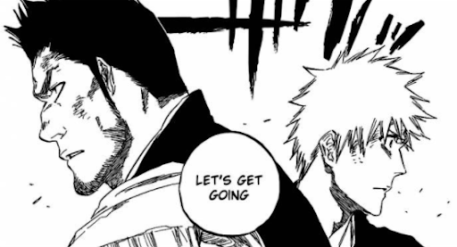
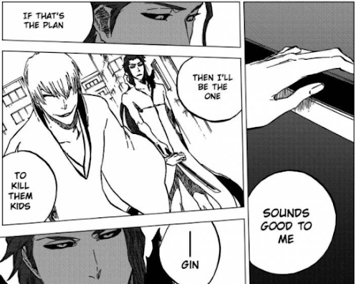
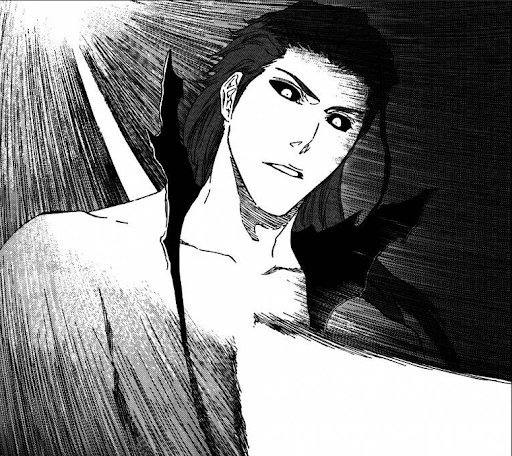
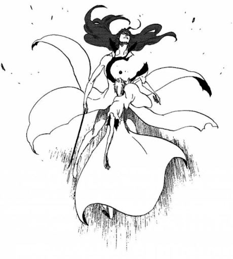
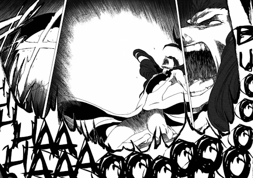
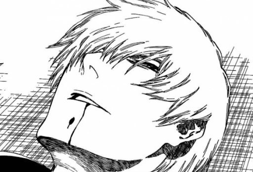
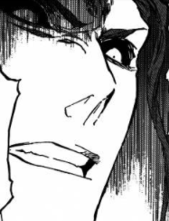
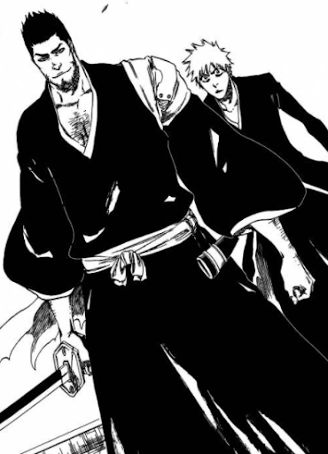

[*Updated on January 3rd, 2024*]

Bleach, like a lot of anime/manga, started off strong and then saw a pretty consistent decline in quality as time went on. Still, the part of Bleach that always stuck out to me as the most disappointing wasn't the abysmally bad final arc of the manga, but the end of the Aizen arc. Random, unearned power ups and nonsensical abilities were nothing new to Bleach at that point (and they'd definitely get worse as the story went on) but the thing that made the final battle with Aizen particularly annoying is how easily it could have been tweaked to have been infinitely more satisfying than what we got. It had *potential*. As someone who was pretty invested in the series during my college days, here's my attempt at a basic outline of how I think the lead-up to the final battle of the Aizen arc could have been better with minimal changes: 

---

In order to avoid changing too much, I'd start tweaking things after the big confrontation between Aizen and the heroes in Fake Karakura Town. Aizen has defeated everyone, and is leaving Ichigo behind as he heads for Soul Society through a portal, Gin at his side. 

Ichigo is shaken and despondent, but his father talks him through it. They understand that they're likely no match for Aizen in his current state, but both resolve to go after him anyway as they're the only ones left who could even hope to put up a fight with their combined powers. They step through the portal ready to make a final stand, together. **Unlike what happens in the manga/anime, there is no time for any last minute training sequences or powerups here.**

Now we continue on with how things went in the manga/anime, with Aizen and Gin walking through the city they just teleported to. They begin to talk about what they plan on doing next. 

As Gin assures Aizen that he'll take care of the remaining stragglers/characters nearby, he puts his hand on Aizen's sword, and suddenly extends his own sword out and pierces Aizen through his chest. Everything in this scene is still playing out more or less as it did in the manga.

(Also worth noting, I'd probably change up Aizen's design here if I could and get rid of that awful mullet thing he has going on in this form.)

Aizen looks down in surprise and begins to process what's happening. Gin explains his long con, and Aizen is shown being legitimately caught off guard, at least to some extent. You see a slight tinge of confusion in Aizen's eyes, which quickly changes to anger. But it's too late. 

The poison in Gin's sword takes effect, and a hole is blasted into Aizen's chest as he falls to his knees. Gin stands triumphant. 

Aizen begins to break down, both physically and mentally. He's angry and confused, but his newly ascended body begins to try and repair the damage as best it can. It's not enough though, as Gin's poison continues to break Aizen's body down. The speed at which Aizen's body is able to heal is being matched by the decay caused by Gin's poison, leaving Aizen injured but not finished. He's in pain and severely weakened, but still capable, dangerous, and very angry/erratic. 

Gin realizes what's happening and begins to panic a bit. He understands that his attack is causing Aizen to weaken, but is also realizing that his poison may not have been quite enough to end Aizen on its own like he'd hoped. Seeing Aizen in his current state however, Gin resolves to finish the job quickly by himself, before there's any chance of Aizen recovering. The two cross blades, but Aizen, in his erratic/enraged state, eventually manages to overwhelm Gin. He's no longer cocky and cool, but unhinged and clearly in pain. He stands over Gin, ready to end him, when we see a portal open behind him. 

Ichigo and his father step through, clearly confused at this unexpected turn of events they're seeing but ready for battle. Gin makes eye contact with them and they understand each other. Aizen lets out a furious yell. 

From here, the stage is set for a *real* final battle, one where Ichigo doesn't have to rely on some last minute, nonsensical power up. Aizen has been weakened through a stroke of luck/strategy that nobody could have foreseen, and now Ichigo and his father can engage Aizen in his current state together, on more or less even footing.  

