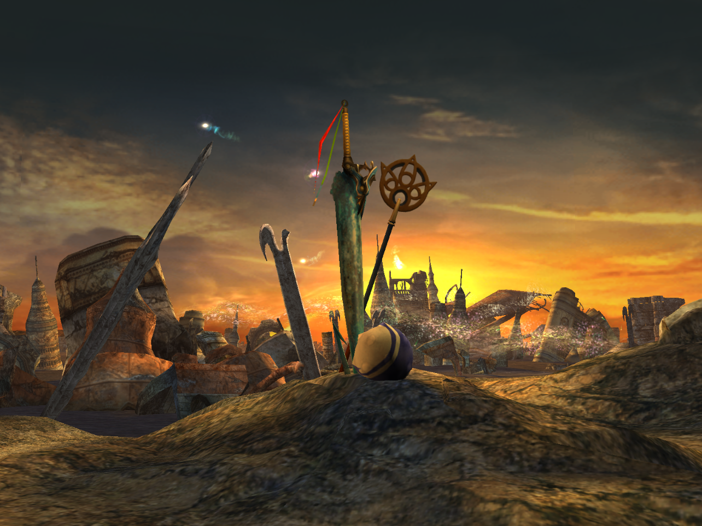

*\*Spoilers for Final Fantasy X ahead\**

The finale of Final Fantasy X contains the now infamous English localization decision to change the ending’s emotional climax from “Thank you” (“Arigatou” in the original Japanese) to “I love you”. Naturally, this sparked fan debates that have now raged on for decades, with many fans arguing in defense of the change and others arguing that it strays too far from the original’s intended meaning and misses its point entirely. I fall firmly into the latter camp, and while I know this conversation has been done to death, *this is my blog* so I think it’s finally time for me to join the fray and try to break down why I think the original Japanese line serves the story best, and how the English localization’s failure to capture the emotional depth and meaning of the original actively takes away from the game’s narrative and overall themes. 

The end of the game sees the party defeating Yu Yevon and ending his death fueled dreaming of a long lost civilization, finally freeing the world of Spira from a millennium of stagnation. We watch as Auron, whose lingering regrets kept him tethered to the world after death as an Unsent, is finally able to move on to the Farplane, and and we witness Yuna perform a final sending for the Aeon’s/Fayth who are finally free to rest. All of this sets the scene for our big moment.

Atop the party’s airship, Tidus begins to fade away as the Fayth’s dreaming ends. Knowing his time is up, he attempts a rushed goodbye to Yuna and begins to walk away from the party as they struggle to come to terms with what’s happening. It’s in this moment that Yuna, not yet ready to let Tidus go, rushes toward him only fall through his increasingly incorporeal body. This causes Tidus’s stoic veneer to shatter as he begins to openly weep, struggling to accept that his life with Yuna and the others has to come to an end. 

As the finality of the moment sinks in, Yuna manages to regain her composure and decides that she must be strong in order to help them both achieve some kind of closure and acceptance of the inevitable, so she says the one thing that needs to be said:

“Thank you.” 

A sincere and solemn expression of gratitude that encompasses and acknowledges the entirety of their past and everything Tidus has given her, containing a depth of emotion that leaves little room for unanswered questions or loose ends. This serves as a poignant farewell that signifies acceptance and also serves as a reassurance to Tidus that he can go now without any regrets. Nothing more needs to be said, and as Tidus turns toward Yuna we see clearly in his expression that he understands the weight of what he’s just heard. He walks over to Yuna with renewed resolve and embraces her one final time, responding to her gratitude with his own before fading away as the party bids him farewell. 

The closure that comes from this moment of earnest and complete gratitude allows the focus of the scene to remain firmly on how the character’s are choosing to deal with their loss through acceptance, a choice that the game’s narrative explores constantly. Spira’s spiral of death and grief began with Yu Yevon’s unwillingness to accept the loss of Zanarkand, but the narrative continues to show us examples of characters learning to confront their grief in ways that won’t keep them trapped by it. The very concept of the Unsent is a constant reminder throughout the story of the importance of how one chooses to accept loss, and Yuna’s arc culminates in her determination to live on with her sorrows instead of accepting Yevon and Yunalesca’s vision of a world ruled by death and loss. Tidus, after spending so much of the game rejecting (what he  at the time believed was an inevitable) death, responds to the revelation of his own impending death with gratitude for the life he was given, and so Yuna’s response to the tragedy of Tidus’s death also being one of gratitude reminds both him and the audience of the importance to meet loss with acceptance. 

Now as far as the English localization goes, in that moment where Yuna and Tidus understand the inevitability of the situation and Tidus wavers in his resolve to to accept it, Yuna saying “I love you” shifts the tone and focus of the scene completely. It’s no longer a statement of acceptance and closure, and it’s not what a character in Tidus’s position needs to hear to let go of any lingering regrets or attachments. Instead of closing doors it would likely open more doors to regret for both of them, further tethering Tidus to the world and reminding him of what could have been, pushing both him and Yuna further away from being able to fully let go and move on. 

It also shifts the scene into a more overtly romantic tone which feels out of place within the context of the overall narrative and distracts from the previously mentioned themes of the game by narrowing the focus of the scene onto the feelings and relationship between the Yuna and Tidus. Final Fantasy X is a game that contains within it a prominent romance, but that romance is not the primary focus of the game (I’ve heard that the English script in general pushes a more overtly romantic tone throughout the entire game that doesn’t exist as strongly in the Japanese. This would be another troubling localization overstep if true). Having romance take center stage during the emotional climax of a game that wasn’t primarily focused on romance feels like a confused misstep, as well as an attempt to appeal to perceived Western cultural sensibilities and expectations. This feels both clumsy and cynical, and I don’t buy for one second that gratitude can’t be understood by Western audiences as being a complex, nuanced, and powerful emotion during a scene like this. A heartfelt thank you can and often does carry within it a multitude of meanings, love included, even to Western cultures and minds. 

That being said, there’s also the fact that this is not a Western story but a Japanese one, and I firmly believe that localizers should prioritize conveying the story as it is told by maintaining tone and intended meaning instead of trying to morph the narrative into something that more easily meets the expectations of an entirely different culture. The audience should be allowed to experience, be challenged by, and engage with something different, unexpected, or new.

As a small aside, I also think it’s worth mentioning how I think the ending might affect one’s interpretation of the somewhat ambiguous after credits scene (which shows Tidus awaken underwater and swim toward the surface). I’m not fond of ambiguous endings in general as they tend to open the door for interpretations that undermine the core messages of the story that was just told, but one benefit of the original Japanese text is that by keeping a steady and consistent tone throughout the ending that’s centered around the main themes of loss and acceptance, you’re primed to think of interpretations consistent with those themes (metaphorical rebirth or some kind of afterlife, which is also supported by some optional in-game text given by Shiva’s Fayth toward the end of the game). The English focus on romance might instead encourage one to go for the more literal interpretation (physical rebirth and reunion) which undermines the themes that have been repeated up until this point throughout the game. (This is similar to how the existence of a sequel might also undermine this games themes, so it’s a good thing FFX never got one of those!)

Hopefully I’ve managed to convey exactly why I think the original Japanese “Thank you” possesses a level of depth that elevates the finale in a way the English change to “I love you” simply can’t. The english localization abandons the complexity of a simple expression of gratitude in the face of loss in favor of a narrow focus on romance, a choice that seems more concerned with Western audience reception than faithfully preserving the spirit of the original text. It’s that simple expression of gratitude that also allows that scene to be a powerfully bittersweet moment of acceptance that reminds the audience of the major themes that were echoed throughout the story, and which ultimately gives us a more cohesive, consistent, and satisfying narrative overall.
